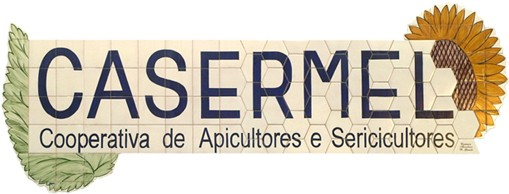

Bem vindo ao arquivo documental da CASERMEL! 

Esta página têm por objetivo documentar e servir como arquivo dos vários documentos necessários à apicultura, 
bem como ser um complemento ao site da `CASERMEL <https://www.casermel.pt>`__.

Esta página visa propocionar aos seus visitantes um auxílio na procura de informação relacioanda com o mundo da apicultura regional.

.. tip:: Através do painel lateral esquerdo é possível procurar, 
			consoante o tópico, um assunto específico. 
		
.. _readthedocs.org: http://www.readthedocs.org

Estrutura
==========

Este documento foi estruturado da seguinte forma:

-  **Apicultra**
  
	.. note:: É pretendido de uma forma geral, apresentar assuntos relacionados com a apicultura. 

-  **Legislação**
  
	 .. note:: Esta seção têm como objetivo agregar toda a legislação nacional e/ou regional.
	 
-  **Modelos**
  
	 .. note:: Aqui poderá encontrar todos os documentos, sejam eles modelos ou anexos, da legislação em vigor. 

Contribuição
============

Caso pretenda contribuír no melhoramento deste documento, por favor `envie-nos um email <apoio@casermel.pt>`__ com as suas sugestões.

Qualquer e toda a ajuda é bem vinda! 

